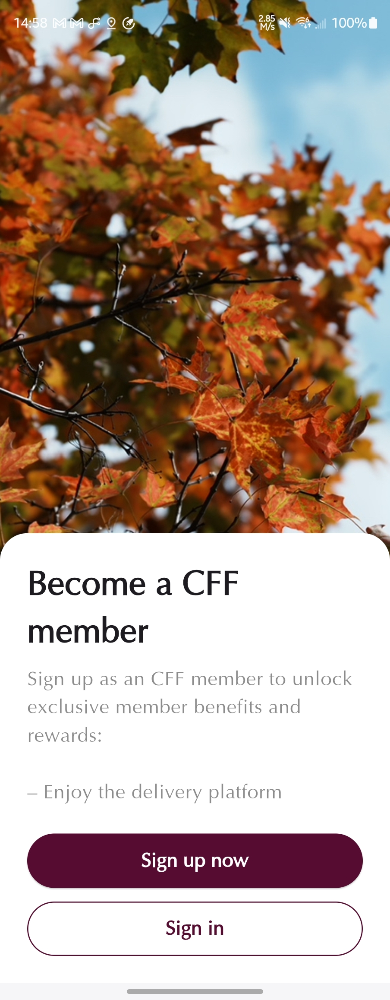
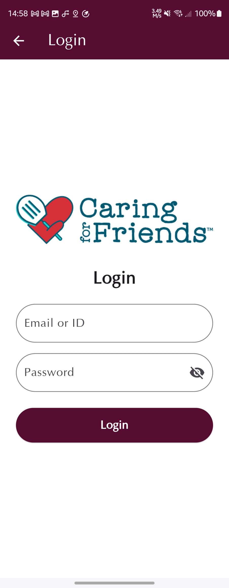
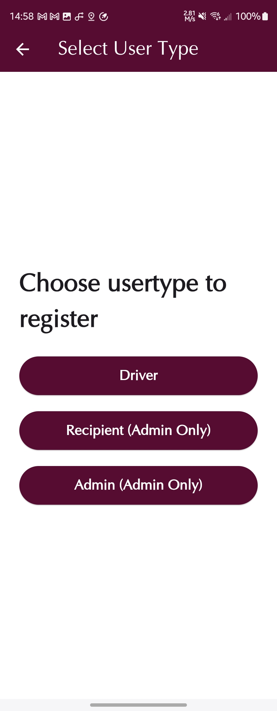
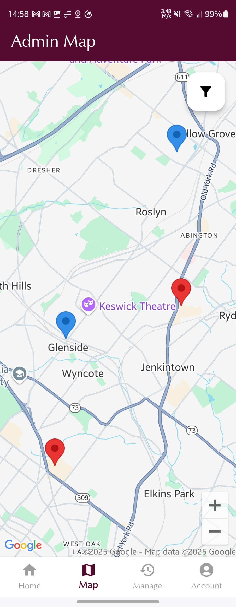
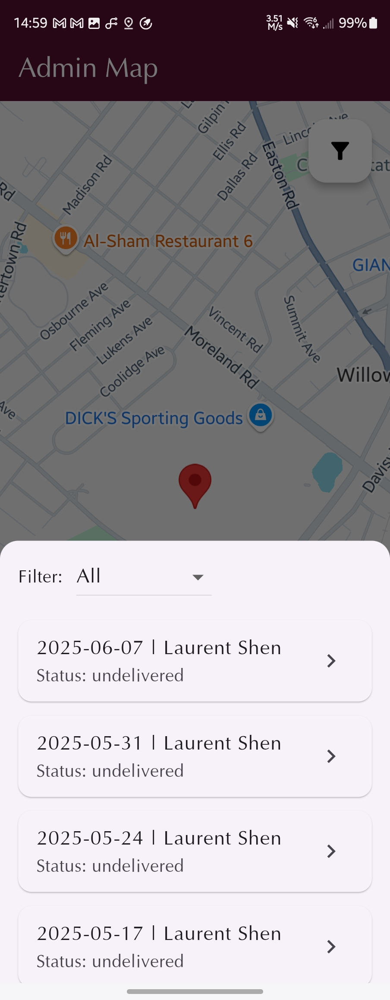

# 📱 CFF Mobile

> Caring for Friends Mobile App — Supporting delivery operations for a Philadelphia-based nonprofit.

  
*(Replace with your actual project logo)*

---

## 📥 Download

You can download the presentation and related materials here:

- 👉 [Click to download from GitHub](https://github.com/resources/)  
- 🌐 [Click to download from external website](https://szr.hk/public/downloads/cff_projects/)

> ⚠️ Replace the above links with your actual repository or website URLs.

---

## 🧭 Overview

Caring for Friends is a nonprofit organization that provides meals to the homebound, homeless, and hungry across Philadelphia.  
Despite wide coverage, many individuals still need meals delivered.  

**CFF Mobile** is designed to support and optimize this delivery process through a dedicated mobile application.

---

## 📝 Presentation Outline

- App Overview  
- Database  
- Mockups & UI  
- Demo  
- Challenges  
- Future Work  

---

## 📌 App Overview

- **Driver**:  
  - Interactive map with search  
  - Pinpoints and highlights unfinished deliveries  
  - Tracks volunteer hours  

- **Admin**:  
  - Search drivers and recipients  
  - View delivery history  
  - Manage future scheduled deliveries  

---

## 🗃️ Database

- **Architecture**: Cloudflare + SQL  
- **Focus**: Volunteer delivery management, scheduling, and secure backend support.

---

## 🧪 Mockups & UI

We used **Figma** to design mobile mockups and UI components before development.

### What is a Mobile Mockup?  
A mockup is a way to create and visualize your app through digital design before actual implementation.

### What is UI?  
UI refers to how users interact with the display and the application on their device.

---

## 🖼️ UI Previews *(Screenshots Placeholder)*

Place your screenshots inside the `images/` folder and insert them like this:







```markdown

